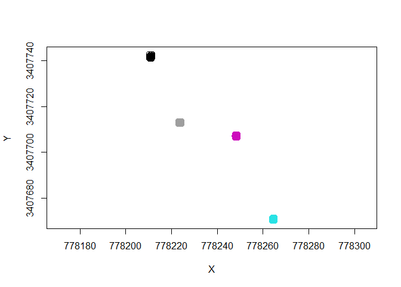
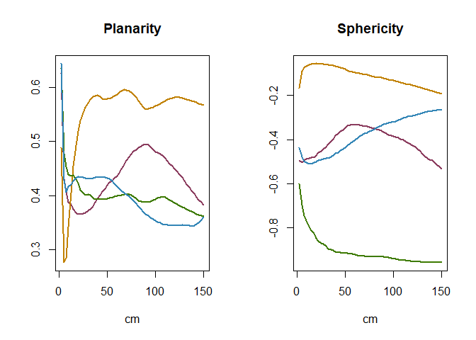

# Supplementary material for “3D point cloud semantic segmentation through functional data analysis”

Supplementary codes and data used in the paper “*3D point cloud semantic
segmentation through functional data analysis*”.

Please cite this paper as:

    @article{oviedo2023PointCloud,
      title={3D point cloud semantic segmentation through
    functional data analysis},
      author={Oviedo de-la Fuente, Manuel, Cabo, Carlos, Roca-Pardiñas, Javier, Loudermilk, Lousie and Ordóñez Celestino},Accepted in JABES
      year={2023}
    }

# Installation

In order to use paper implementation and run all files (numerical and
real example), the following prerequisites are needed:

## 1. `fda.usc` package

<!--To install `fda.usc.devel` package (devel version of `fda.usc`) from Github with (2023/03/29):
&#10;
```r
#install.packages("remotes")
remotes::install_github("moviedo5/FDA_3D_Point_Cloud/fda.usc.devel")
# install.packages("devtools")
# require(devtools)
# devtools::install_github("moviedo5/FDA_3D_Point_Cloud/pkg/fda.usc.devel")
```
-->

Our proposed method is available in the `fda.usc` package (devel
version) through the functions `classif.gsam.vs()` and
`classif.ML.vs()`.

## 2. `PointNet` model

PointNet was improved using a hierarchically approach called PointNet++
\[9\].

Referencia a github

Qi R, Yi l, Su H, Guibas LJ (2017) “PointNet++: Deep hierarchical
feature learning on point sets in a metric space”, Proc. Adv. Neural
Inf. Process. Syst. 30 (NIPS), pp. 5105-5114

## 3. `DGCNN` model

DGCNN is a deep learning (DL) model for point cloud classification and
semantic segmentation

Referencia a github

Wang Y, Yongbin S, Ziwei L, Sarma S Bronstein M, Solomo J (2018) Dynamic
Graph CNN for Learning on Point Clouds. ACM Transactions on Graphics 38
2018 doi = 10.1145/3326362

<!--# Simulation (Numerical Studies)
&#10;+ `./inst/script/Simulation.R`: Code for main simulation.
  &#10;
```r
library(fda.usc.devel)
# source("./R/Simulation.R")
```
-->

# Real Data Application: 3D cloud point

Our case study example is 3D cloud point.

``` r
library(fda.usc.devel)
load(file="./data/ldf.train.RData")
class(ldf.train)
```

    ## [1] "ldata" "list"

``` r
n <- nrow(ldf.train$df)
# Response
table(ldf.train$df$class)
```

    ## 
    ## branch+leaf        bush       grass       trunk 
    ##        1818        1948        1711        1770

``` r
labels <- c("trunk","grass","branch+leaf","bush")
#levEn <- levels(ldf.train$df$class)
# predictor variables (multivariate)
predictors <- names(ldf.train$df[-c(1,2,3,5,6,831)])
# linear correlation between predictors
# dfcor <- cor(ldf.train$df[,c(predictors)])
```

Locations

``` r
tab <- table(ldf.train$df$parcela)
iparcela <- c(0,2,6)
sum(tab[-iparcela]) # 100k,250k,500k
```

    ## [1] 5395

``` r
prop.table(tab)
```

    ## 
    ##         4         5         6         7 
    ## 0.2667311 0.2555540 0.3118532 0.1658617

``` r
ii <-1:400000
plot(ldf.train$df[ii,1:2],col=ldf.train$df$parcela[ii]+1,asp=T)
ii <- ldf.train$df$parcela %in% c(0,2,6) 
points(ldf.train$df[ii,1:2],col=1)
```

<!-- -->

Functional mean curves for `Planarity` and `Sphericity` features
(colored by class label).

<!-- -->

*This repository is under development, codes with examples will be
included soon* <!--## References-->
